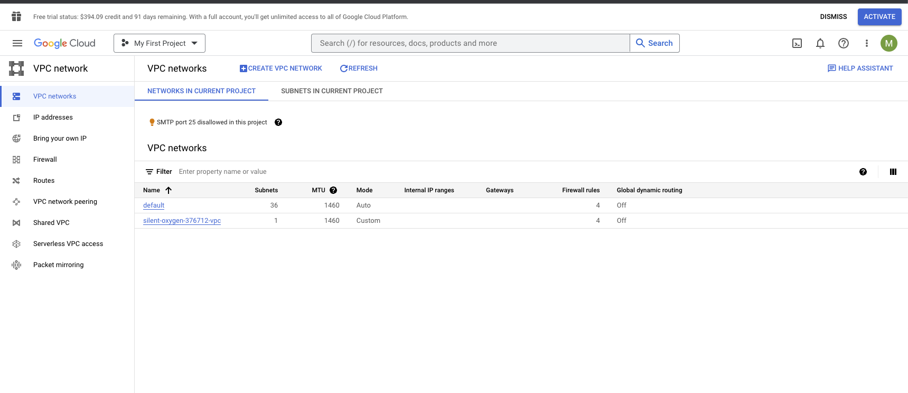
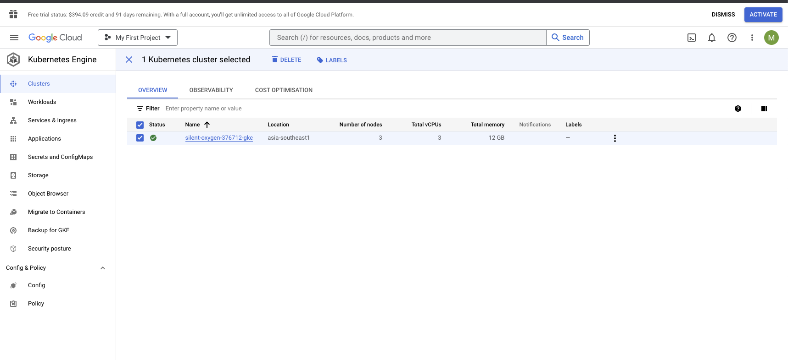
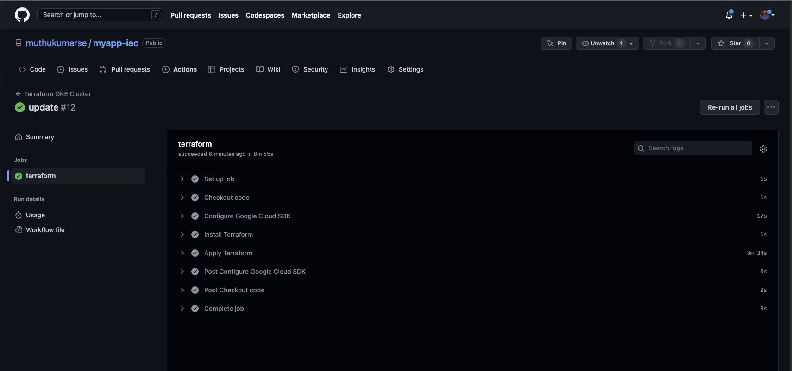

## How to run manually
- Please setup your own Google account and sigup in Google console.
- Note - I tested all of these and tear down my environment not to get any billing :)
- change `project_id` from your account in [terraform.tfvars](./terraform.tfvars)
- Aussume that you already connected your Google account through `google-cloud-sdk` and check you have `~/google_application_creedentials.json`
- `terraform init`
- `terraform apply`
- Note:
  - Used generic way (simlar to test lab) to create GKE
  - left detaulf working one with quick lab
  - TODO - should do IAM and other stuff for GKE API 

## Clean your cluster
- `terraform destroy`
- *** Don't forgot ***

## Test I have done
- Created cluster over github action
- setup `GOOGLE_CREDENTIALS` in github action to run pipeline
- Run the pipline manually after clean up all test.
- made small change no of nodes to trigger pipeline
- Will run automatically and update the environment
- Finally cleaned up everything manually.
- Note:
  - waring are ignorable, since there few update on github Action api which need to correct by looking correct version@latest
  - if you struck in between of creating resouces half way, no choice we have to clean that and retry.
  - once the pipeline run successfully then we have state so it will be easier to update further.
  
  ## Screenshots
  
  

  

  
